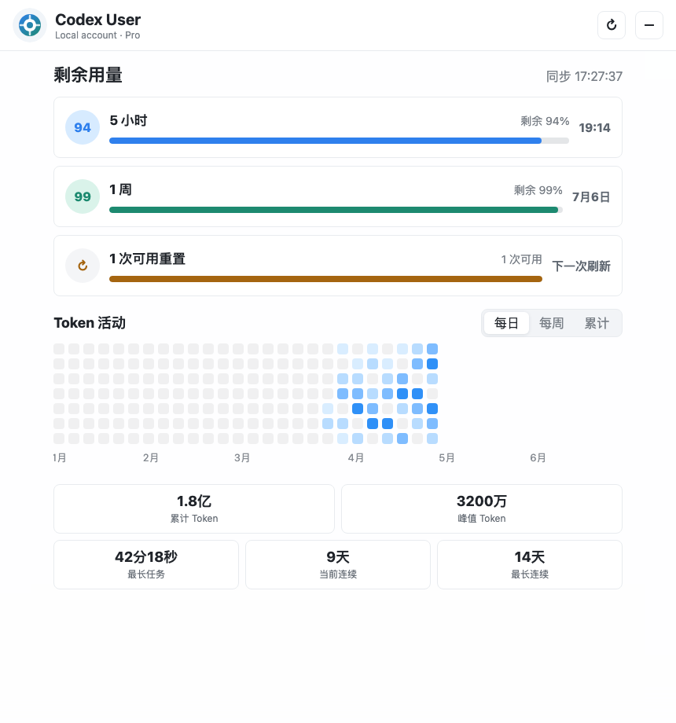

[English](README.md) | **中文**

# 看得见的 Codex 用量

一个本地 Codex Skill，把 Codex 剩余用量、重置时间、Token 活动和连续使用数据做成一个紧凑面板，可以在工作时常驻查看。

**理念：** 把限制放在眼前，让你提前规划任务，而不是在长任务中途才发现额度快没了。



## 你会得到什么

一个本地运行的 Codex 用量面板，包含：

- 当前短窗口和每周窗口的剩余用量
- 与 Codex 本地用量数据同步的进度条和重置时间
- 从 Codex 本地账号生成的个人资料展示，并支持自定义昵称/头像
- 26 周 Token 活动热力图
- 累计 Token、峰值 Token、最长任务和连续使用天数
- 一键刷新和折叠视图
- 可选的新对话自动打开 hook
- 英文和中文文档

## 快速开始

1. 在 Codex 中安装这个 skill
2. 输入 "install Codex usage panel" 或调用 `$codex-usage-panel`
3. Agent 会用对话方式帮你完成安装——不需要手动编辑配置文件

Agent 会自动：
- 把面板复制到 `~/.codex-usage-panel`
- 启动本地面板服务
- 启动后台用量同步进程
- 打开 `http://127.0.0.1:8765/index.html`

不需要 API key。安装完成后会立即进行第一次同步。

## 修改设置

面板可以通过对话管理。直接告诉 Codex：

- "Open my Codex usage panel"
- "Repair the usage panel"
- "Use port 8876"
- "Refresh usage data"
- "Auto-open the panel in new conversations"
- "Set my panel profile name and avatar"
- "Package this skill for sharing"

如果 `8765` 端口被占用，安装器会自动选择附近可用端口，并输出最终访问地址。

在 macOS 上，安装器现在会先停掉自己的旧服务再选择端口，避免误判端口占用导致从 `8765` 漂到 `8766`。如果上一次安装使用过其他端口，也会保留旧地址作为兼容入口。你也可以显式添加：

```bash
node ~/.codex/skills/codex-usage-panel/scripts/install-panel.mjs --port 8765 --alias-port 8766 --open
```

重新安装时会保留 `~/.codex-usage-panel/profile.json`，并保留其中引用的本地头像文件，例如 `./profile-avatar.png`。

## 新对话自动打开

Codex 目前没有内置设置可以把自定义 HTML 面板固定注入到每一个对话正文里。这个 skill 提供了一个本地 `SessionStart` hook：当 Codex 启动或恢复对话时，自动打开用量面板地址。

开启：

```bash
node ~/.codex/skills/codex-usage-panel/scripts/install-auto-open-hook.mjs
```

移除：

```bash
node ~/.codex/skills/codex-usage-panel/scripts/install-auto-open-hook.mjs --remove
```

第一次运行 hook 时，Codex 可能会要求你 review 并信任它。这个 hook 只会打开 `http://127.0.0.1:8765/index.html`。

## 自定义面板

你可以通过两种方式自定义：

**通过对话（推荐）：**
直接告诉 Codex 你的需求，例如 "让它更紧凑"、"只显示 3 个月"、"换一个强调色"、"隐藏连续天数"。Codex 可以帮你修改面板。

**直接编辑（高级用户）：**
编辑 `assets/panel/` 中的文件：
- `index.html` — 面板结构
- `panel.css` — 布局和视觉样式
- `panel.js` — 刷新、折叠、热力图和渲染逻辑
- `usage-data.js` — 示例兜底数据，安装后会被同步进程覆盖

重新安装或刷新本地面板后即可看到变化。

### 个人资料显示

Codex 本地 app-server 目前会暴露账号邮箱和套餐，但不会暴露 ChatGPT 的显示昵称或头像 URL。面板会用本地账号信息生成个人化的名称、handle 和首字母头像，避免所有用户都显示同一个默认身份。

如果你想精确显示昵称和头像，可以创建 `~/.codex-usage-panel/profile.json`：

```json
{
  "name": "Luke_Ji",
  "handle": "@jasondongsheng",
  "avatarUrl": "https://example.com/avatar.png"
}
```

然后运行一次同步：

```bash
node ~/.codex-usage-panel/scripts/sync-usage.mjs --root ~/.codex-usage-panel
```

也可以在安装时直接设置。`--profile-avatar` 可以是图片 URL，也可以是本地图片路径：

```bash
node ~/.codex/skills/codex-usage-panel/scripts/install-panel.mjs --profile-name "Luke_Ji" --profile-handle "@jasondongsheng" --profile-avatar ~/Pictures/avatar.png --open
```

## 默认视图

### 剩余用量

展示当前短窗口额度、每周额度、可用重置次数、进度条和重置时间。

### Token 活动

用紧凑热力图展示最近 26 周的每日 Token 活动，并支持每日、每周、累计三种显示方式。

### Token 概览

展示累计 Token、峰值 Token、最长任务、当前连续天数和最长连续天数。

查看 [examples/sample-panel.md](examples/sample-panel.md) 了解面板输出示例。

## 安装

### Codex

```bash
git clone https://github.com/noskinodesign/codex-usage-panel-skill.git ~/.codex/skills/codex-usage-panel
```

然后打开 Codex，输入：

```text
Use $codex-usage-panel to install and open a local Codex usage dashboard.
```

也可以直接运行安装器：

```bash
node ~/.codex/skills/codex-usage-panel/scripts/install-panel.mjs --open
```

### Release Zip

从 GitHub Releases 下载 `codex-usage-panel-skill.zip`，然后：

```bash
mkdir -p ~/.codex/skills
unzip codex-usage-panel-skill.zip -d ~/.codex/skills
```

## 系统要求

- macOS
- 已安装 Codex 桌面端
- Node.js

仅此而已。不需要外部账号、云端后端或用量 API key。

## 工作原理

1. 安装器把面板复制到 `~/.codex-usage-panel`
2. 本地服务通过 `127.0.0.1` 提供 HTML 面板
3. 同步进程每 10 秒读取 Codex 桌面端本地 app-server 用量数据和本地账号信息
4. 面板重新读取本地 `usage-data.js` 并更新显示

在 macOS 上升级时，安装器也会停用早期原型版的 `com.lukeji.codex-usage-panel-*` LaunchAgents，并在端口发生变化时保留旧端口兼容入口，让旧对话里的链接仍然可用。

同步进程会读取本机 Codex app-server 的 `account/rateLimits/read` 和
`account/usage/read`、`account/read` 等方法。

## 隐私

- 不需要 API key
- 没有外部分析
- 本项目不会上传用量数据
- 本项目不会保存账号凭据
- 自定义个人资料只保存在本机 `~/.codex-usage-panel/profile.json`
- 用量数据保留在你的本机 `~/.codex-usage-panel`

## 限制

Codex 目前不支持把自定义 HTML 面板自动注入到每一个对话正文里。推荐方式是把面板固定在 Codex 右侧浏览器、使用内置的自动打开 hook，或者用一个小浏览器窗口常驻显示。

## 许可证

MIT
